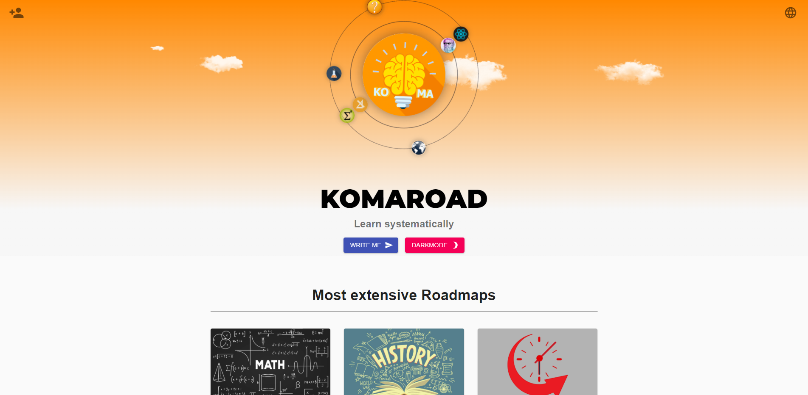
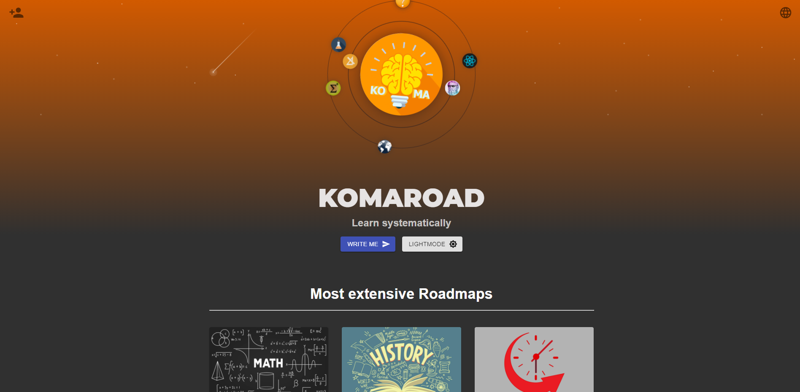
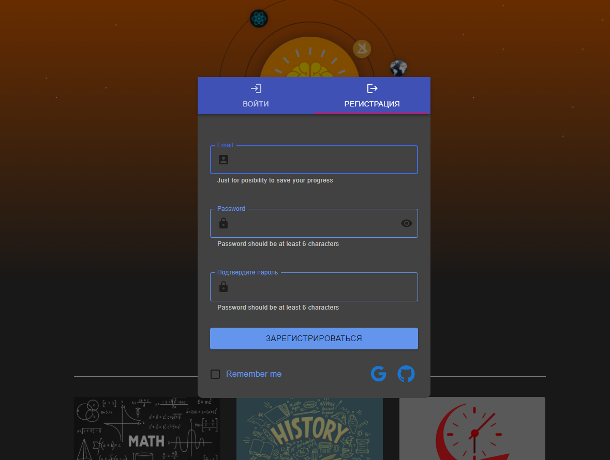
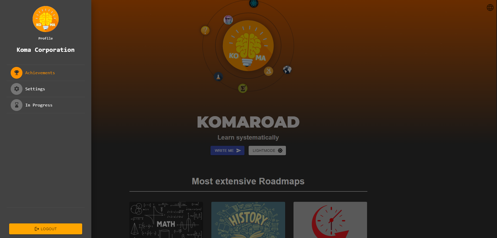
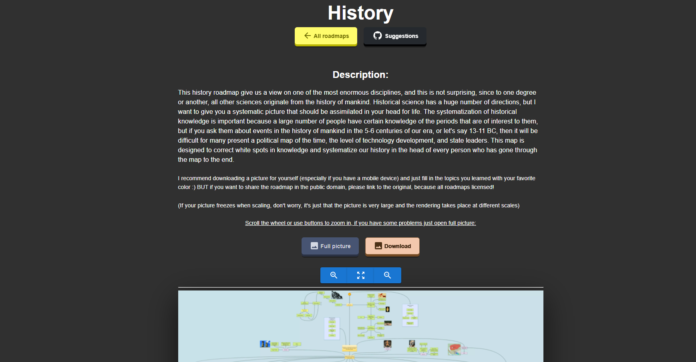
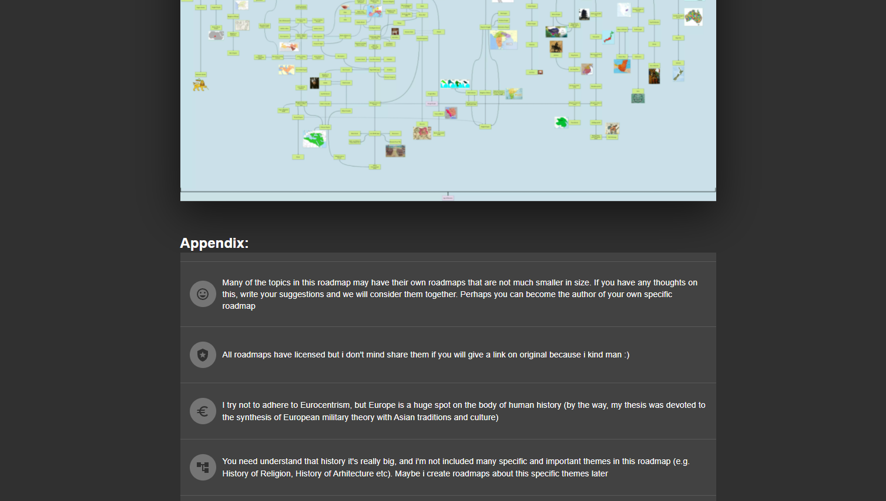
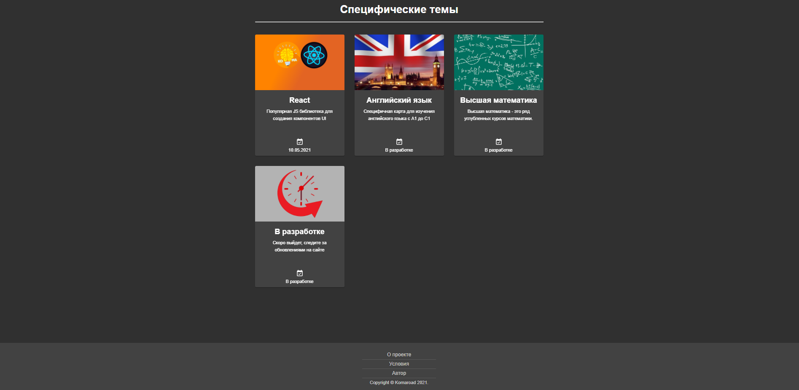
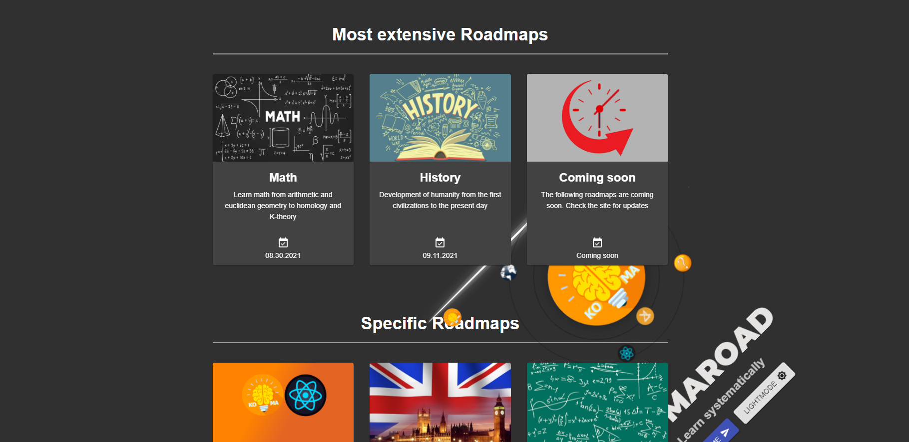

<h1 align='center'> Komaroad - Экстериоризация</h1>
<h3 align='center'>Мой проект, призванный помочь людям систематизировать изучение конкретной области знаний в наш век информационных технологий, где проблема заключается не в недостатке информации, а в ее переизбытке</h3>

=======
<h4 align='center'>Примеры:</h4>

<ul>
<li>Сами Roadmaps в виде изображений</li>
<li>Прототип в Figma - https://www.figma.com/file/DmFqwx0UGhpnknlnbKpSLp/Komaroad?node-id=0%3A1</li>
<li>ReactJS</li>
<li>MaterialUI</li>
<li>react-zoom-pan-pinch</li>
<li>react-i18next</li>
<li>react-awesome-button</li>
<li>Вынести кнопки в отдельный компонент</li>
<li> Отдельный путь для роадмапов по кнопке</li>
<li> Выровнять ширину всех Card с роадмапами чтобы не съезжали при респонсивке</li>
<li> тултипы</li>
<li> кнопка скачать и открывать картинку в новом окне</li>
<li> крутящееся пасхальное яйцо</li>
<li> дата ниже яйца</li>
<li> lazy loading на роадмапы + кнопки</li>
<li>SEO first part</li>
<li>think about too large images... - webp</li>
<li>Авторизация и регистрация</li>
<li>drawer - profile, achievements, settings, logout</li>
<li>Обернуть всё в Skeleton? и setTimeout</li>
<li>Добавить облака и шутинг стар? через тернарки?</li>

✔✔✔✔✔✔✔✔✔✔✔✔

<li>Accessibility?</li>

</ul>

=======
<h3 align='center'> How it's possible?</h3>

</ul>

